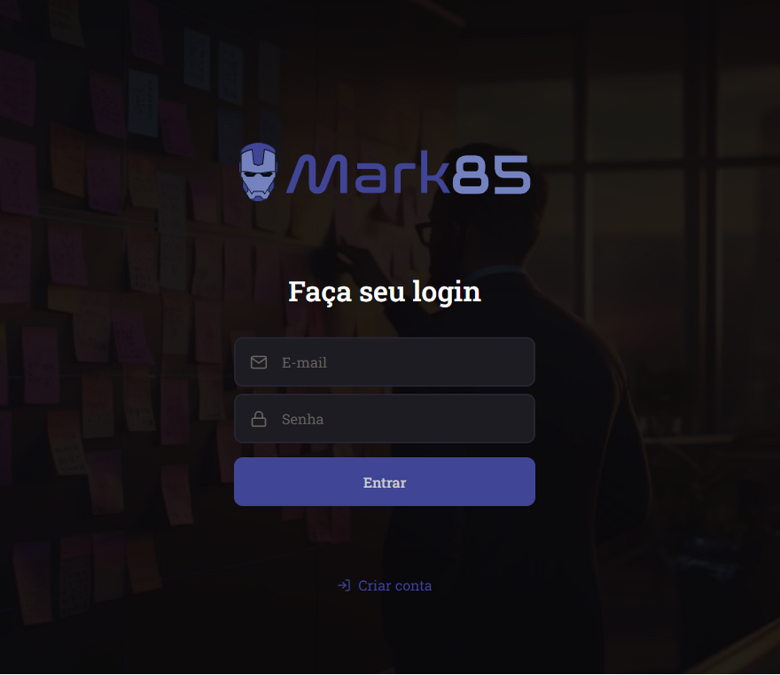
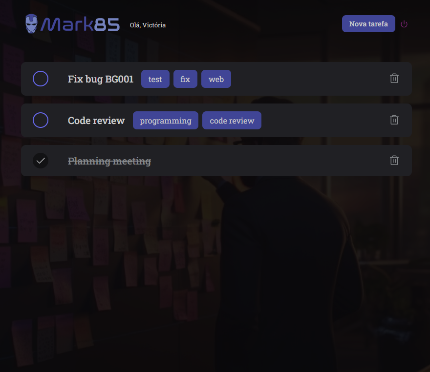

# robot-express
 
Automated tests for a ToDo list web application using Robot Framework.

## 📚 Course
[Robot eXpress - Udemy](https://www.udemy.com/course/robot-express/)

## ✅ What I learned
- Robot Framework project structure
- Automated Web testing using Browser Library
- Automated API testing using Requests Library
- Manual API testing using Insomnia
- Test Setup and Test Teardown
- Locator strategies
- Page objects pattern
- Component testing
- Custom Python libs
- Custom commands
- Helper keywords 
- Manipulating JSON objects
- MongoDB connection and data manipulation with PyMongo
- Password hashing with bcrypt Library

## 🌐 Application
*Login page*
 

*Task list page*
 

## 💻 Installation
It is required to have Node.js and Python installed to run this project.

> I used versions `v16.13.1` and `3.12.1` of Node.js and Python, respectively. I suggest you use the same or later versions.

Install Robot Framework dependencies: `python -m pip install -r requirements.txt`

Initialize the Browser library and install node dependencies: `rfbrowser init`